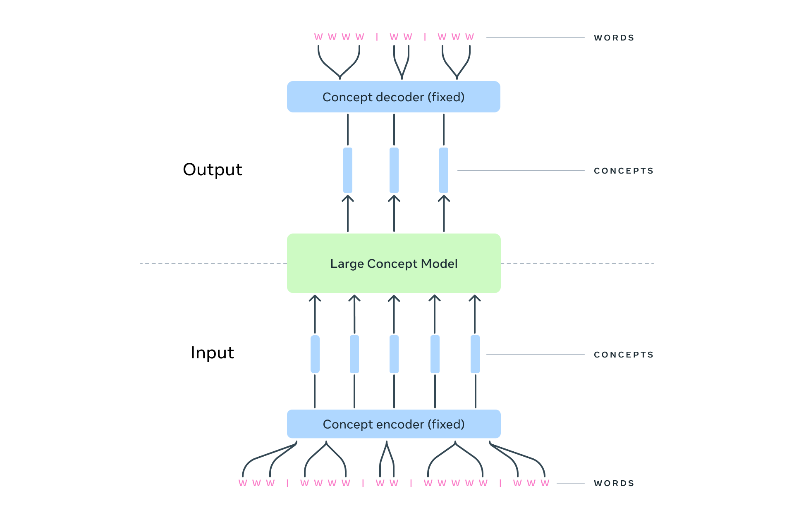

# BaseLCM
This will be the implementation of LCM but only the transformers-base LCM

<p align="center">
  
</p>

From my understanding the LCM  basically focuses more on sentences rather than tokens and since it focuses more on sentences it is able to bypass the transformers quadratic scaling issue  with the increase in sequence length, but also since it works only on sentences it has its limitations like  cannot really focus  on the entire context but this seems to be useful for meta social media app where users typically communicate through short text


# Citations 

```bash
@article{lcm2024,
  author = {{LCM team}, Lo\"{i}c Barrault, Paul-Ambroise Duquenne, Maha Elbayad, Artyom Kozhevnikov, Belen Alastruey, Pierre Andrews, Mariano Coria, Guillaume Couairon, Marta R. Costa-juss\`{a}, David Dale, Hady Elsahar, Kevin Heffernan, Jo\~{a}o Maria Janeiro, Tuan Tran, Christophe Ropers, Eduardo Sánchez, Robin San Roman, Alexandre Mourachko, Safiyyah Saleem, Holger Schwenk},
  title = {{Large Concept Models}: Language Modeling in a Sentence Representation Space},
  publisher = {arXiv},
  year = {2024},
  url = {https://arxiv.org/abs/2412.08821},
}
```
```bash
@misc{Duquenne:2023:sonar_arxiv,
  author = {Paul-Ambroise Duquenne and Holger Schwenk and Benoit Sagot},
  title = {{SONAR:} Sentence-Level Multimodal and Language-Agnostic Representations},
  publisher = {arXiv},
  year = {2023},
  url = {https://arxiv.org/abs/2308.11466},
}
```